# Задание 1

TO-BE архитектура КиноБездны.
Система разделена на отдельные домены и организована единая точка вызова сервисов.

[Container diagram](./diagrams/Container.puml)

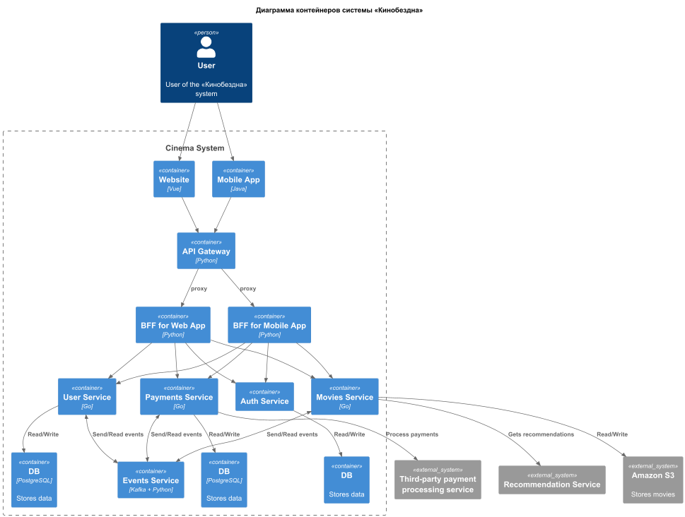

# Задание 2

### 1. Proxy

[postman_tests](./img/postman.jpg)

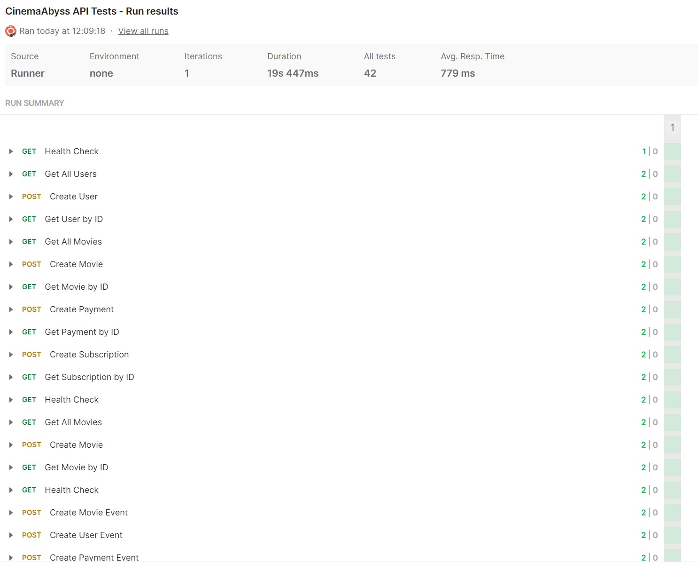
 
[newman_tests](./img/newman.jpg)

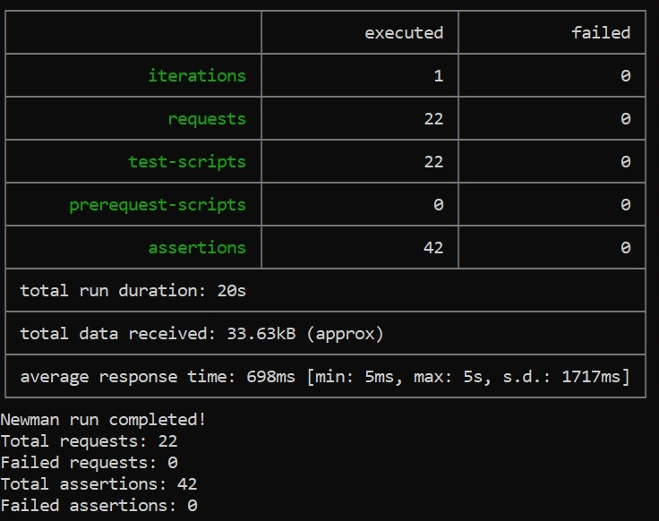

### 2. Kafka

[kafka_img](./img/kafka.jpg)

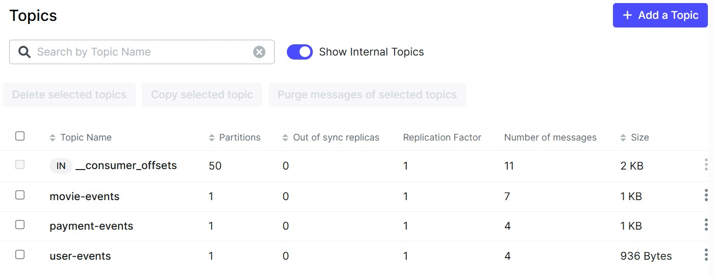

# Задание 3

### CI/CD

Доработан деплой новых сервисов proxy и events.
Успешным результатом данного шага является "зеленая" сборка и "зеленые" тесты.

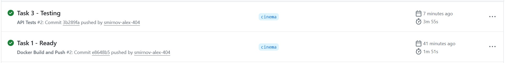
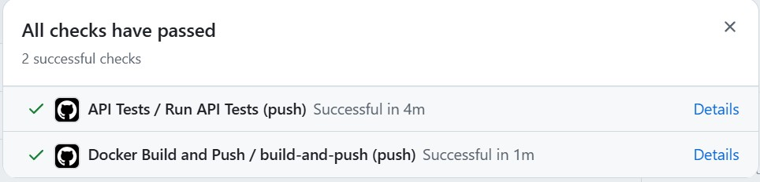

### Proxy в Kubernetes

#### All services started via kuber

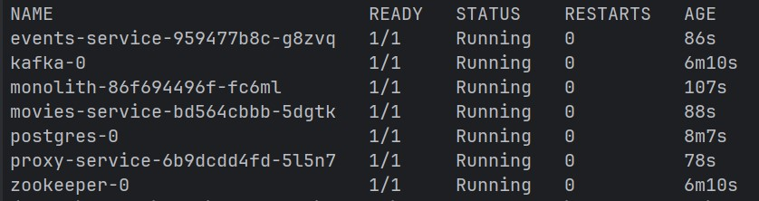

#### Cкриншот вывода при вызове https://cinemaabyss.example.com/api/movies 

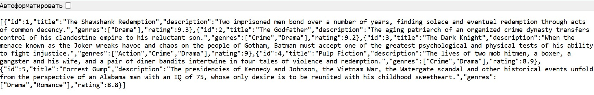

#### Cкриншот вывода event-service после вызова тестов.

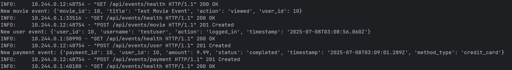

#### Успешный запуск тестов через Newman

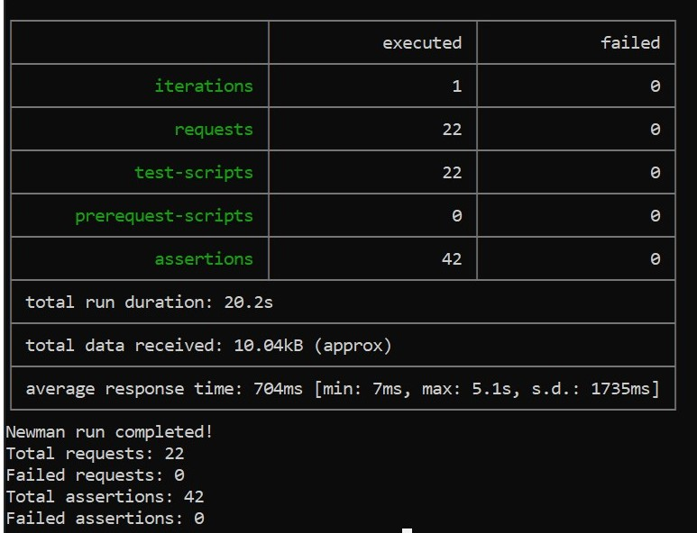

# Задание 4

Cкриншот развертывания helm и вывода https://cinemaabyss.example.com/api/movies

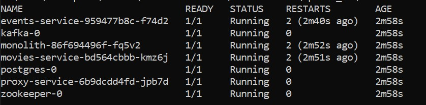
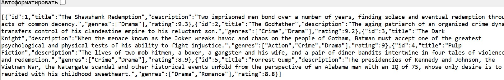